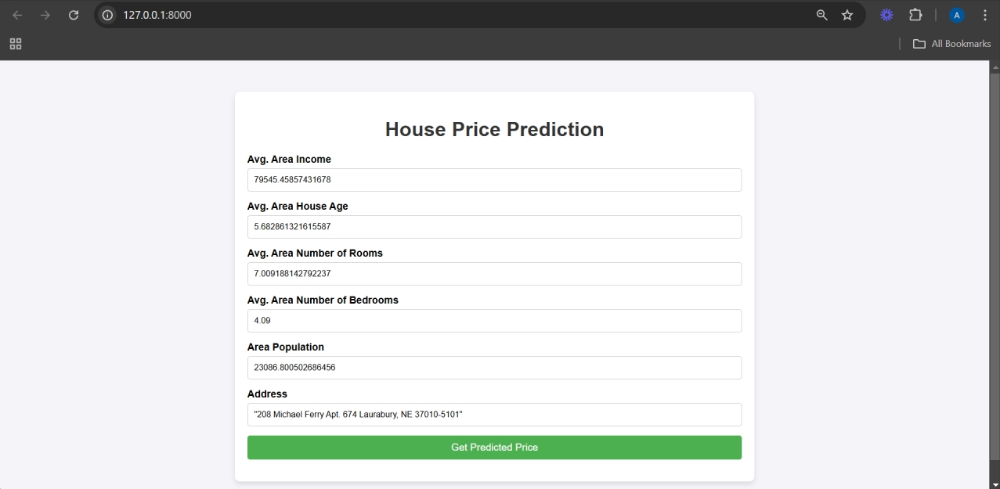

# MlOps HousePricing Project




# Steps to Setup

1. Clone the repo :- 
```
git clone https://github.com/ayush3160/mlops-housepricing.git
```

2. Create virtual environment and activate it :- 
```
python3 -m venv venv

source ./venv/bin/activate
```

3. Install dependencies :-
```
pip install -r requirements.txt
```

4. Run Training Pipeline :-

This check `r2_score` for 4 models (i.e LinearRegression , Lasso , Ridge and Elasticnet) and store the best-model in the `artifacts` directory. It also fetches data from the url `https://raw.githubusercontent.com/connectaditya/House-price-prediction/refs/heads/master/USA_Housing.csv` and stores the csv into three sets `raw.csv` , `train.csv` and `test.csv` .

```
python3 -m src.pipeline.training_pipeline
```

5. Start the FastApi Server :- Open `http://localhost:8000/`
```
fastapi dev main.py
```

Curl request for `/predict` route

```
curl -X 'POST' \
  'http://127.0.0.1:8000/predict' \
  -H 'Content-Type: application/json' \
  -d '{
  "income": 79545.45857431678,
  "house_age": 5.682861321615587,
  "num_rooms": 7.009188142792237,
  "num_bedrooms": 4.09,
  "population": 23086.800502686456,
  "address": "208 Michael Ferry Apt. 674 Laurabury, NE 37010-5101"
}'

```

To run prediction through cli :- 

```
python3 -m src.pipeline.predict_pipeline --income 79545.45857431678 --house_age 5.682861321615587 --num_rooms 7.009188142792237 --num_bedrooms 4.09 --population 23086.800502686456 --address "208 Michael Ferry Apt. 674 Laurabury, NE 37010-5101"
```


